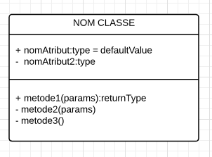
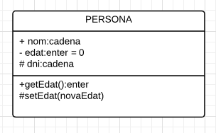
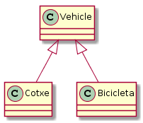
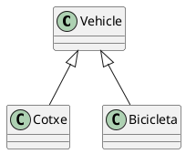
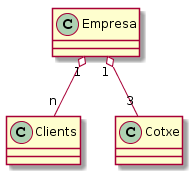
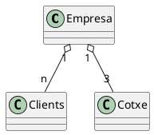
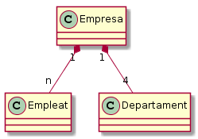
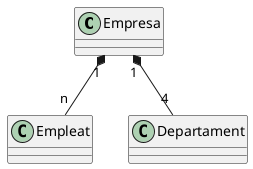

## UML
- Conjunt de diagrames  que modelitzen l'etapa de disseny.
- Hi ha diversos però primer ens centrem en els estàtic concretament en els de classes.
---
## Classe
 - És l'especificació d'objectes amb característiques i comportaments similars.
 - S'encapsula tot el que pot fer un objecte dins la classe.
 - La classe es programa per després poder usar objectes d'aquesta. Des d'altres trossos de codi.
---
### Exemples:  
- [Formulari inscripció](https://alacarral.net/images/documents/estiu2017/inscripcio_estiu_2017.pdf)
- [IKEA](https://www.ikea.com/es/es/assembly_instructions/alex-cajonera__AA-844481-2_pub.pdf)
- [Coche lego](https://www.lego.com/biassets/bi/4639848.pdf)
---
## Propietats / atributs
- Quines dades fan especial a cada objecte (element) de la classe.
- Les propietats són valors que es necessiten.
- Cada propietat té un tipus i un valor.
- *Variables de la classe*
--- 
## Mètodes
- Són les accions que pot fer cada objecte de la classe.
- Es defineixen com funcions de la classe.
--- 
## Visiblitat dels mètodes / atributs
- **privats** En UML - . El seu àmbit és la pròpia classe, només es pot usar des del codi que defineix la classe.
- **públics** En UML és + . Tothom amb accés a la classe pot usar l'atribut o mètode.
--- 
## Visiblitat dels mètodes / atributs
- **protegits** En UML és #. Només poden usar-lo les seves classes descendents. Les que hereden d'ella.
- **package** En UML és ~. Només poden usar aquelles classes / codi que està en el mateix paquet.
---
## Atributs / mètodes ímplicits
- Quan programem una classe tenim un objecte que ens ve definit. És el objecte en si mateix de la classe. 

- El que s'està creant. En Java és **this** i en Python és **self**.
---
## Atributs / mètodes ímplicits

També hi ha una sèrie de mètodes que estan ja predefinits al fer una classe. 
- Convertir entre tipus de dades.
- Per exemple un molt usat, com es converteix a cadena l'objecte.

---

## Traducció a UML
Usarem eines gràfiques:
- [Extensió per a Eclipse](https://marketplace.eclipse.org/content/uml-designer)
- Lucid Chart (incorporat al Drive)
- [Draw.io](http://www.draw.io)
- O codificant usant [PlantUML](http://plantuml.com/class-diagram)
--- 
## Exemple UML


---
## Exemple UML
Classe persona:
```plantUML
@startuml
class Persona {
  +String nom
  -int edat 
  #String dni
  
  -int setEdat()
  +int getEdat()
  ~String getDni()	
}
@enduml
```
---
## Diagrama 

El codi anterior es pot passar a diagrama usant serveis web com:

- [Gravizo](http://ww.gravizo.com) o [PlantUML](http://www.plantuml.com/plantuml/uml/SyfFKj2rKt3CoKnELR1Io4ZDoSa70000) 

Resultat usant PlantUML:


---

## Obecte / Instanciació
### Constructors

- Són els mètodes que es criden quan s'instancia un objecte. 

- Es crea un objecte d'una classe.

- El nom del mètode és el mateix que el de la classe i no retorna res.

---
## Obecte / Instanciació
### Constructors
```java
public class Persona {
	String nom;
	private int edat;
	public Persona(String nom, int edat){
		this.nom=nom;
		this.edat=edat;
	}
	public boolean esMajor(){
		if(this.edat>=18) return true;
		return false;
	}
}
```
---
```python
class Persona: 
	nom=''
	__edat=0
	def __init__(self, nom,edat):
		self.nom=nom
		self.edat=edat
	def esMajor(self):
		if (self.edat >= 18):
			return true
		return false			
```
---
# Instanciació de l'objecte
Quan un objecte es crea, prèn valors, significa que **aquella variable** és instància de la classe.
Com es creen?
```java
public class Institut {
	public static void main(String args[]){
		Persona p = new Persona("Sergi Pérez",23);
	}
}
```
```python
p = Persona("Sergi Pérez",23)
```
--- 
Com treballem amb els objectes, posant un . després de la variable i aleshores escrivint el nom de la propietat o cridant al mètode.
```java
public class Institut {
	public static void main(String args[]){
		Persona p = new Persona("Sergi Pérez",23);
		if (p.esMajor()) System.out.println(p.nom);
	}
}
```
```python
p = Persona("Sergi Pérez",23)
if (p.esMajor()) print(p.nom)
```
---
# Sobrecàrrega d'un mètode
- Quan un mètode es defineix diverses vegades a la classe. Per què:
  - Es passen paràmetres diferents pel que fa al tipus o el nombre.
  - Retorna un tipus de dades diferent.
- Exemple tenir diversos constructors. A Persona un amb el nom i l'altre amb nom i edat.
--- 
# Relacions entre classes: herència
- Les classes es poden relacionar entre elles (normalment per reaprofitar codi).
- Quan unes classes hereden codi d''una classe mare.
- Les classes filles normalment sorgeixen per **especialització** de la classe mare.
  - Hi ha un subgrup d'objectes que són / tenen comportament no comuns amb els altres objectes de la classe mare.
- També pot ser que sorgeixi una classe mare de les filles. Per **generalització**.
  - Hi ha moltes classes amb atributs o mètodes comuns, aquests s'agrupen en una nova classe que serà mare de totes.
---
# Representació UML


---
# Codificació Java
```java
public class Vehicle{
   int nombreRodes;
   int velocitatActual;
   String nom;
   public int accelerar(int acceleracio){this.velocitatActual+=acceleracio;}
}
public class Bicicleta extends Vehicle{

}
public class Cotxe extends Vehicle{
}
```
---
# Codificació Python
```python
class Vehicle:
    nombreRodes=0
    velocitatActual=0
    nom=''
    def accelerar(self,acceleracio):
        self.velocitatActual+=acceleracio

class Bicicleta(Vehicle):
   pedals=2
   def punxar(self):
      velocitat=0
class Cotxe(Vehicle):
   motor
```
---
# Agregació
# Representació UML


---
# Composició
# Representació UML


---
# Sobrecàrrega (II)
- Es sobreescriu un mètode en una classe descendent.
- Exemple:
  - toString en Java. Mètode cridat quan s'usa el +.
  - Accelerar no ho fan igual totes les classes herederes de Vehicle.
---
# Polimorfisme

---
# Encapsulament / seguretat
--- 
